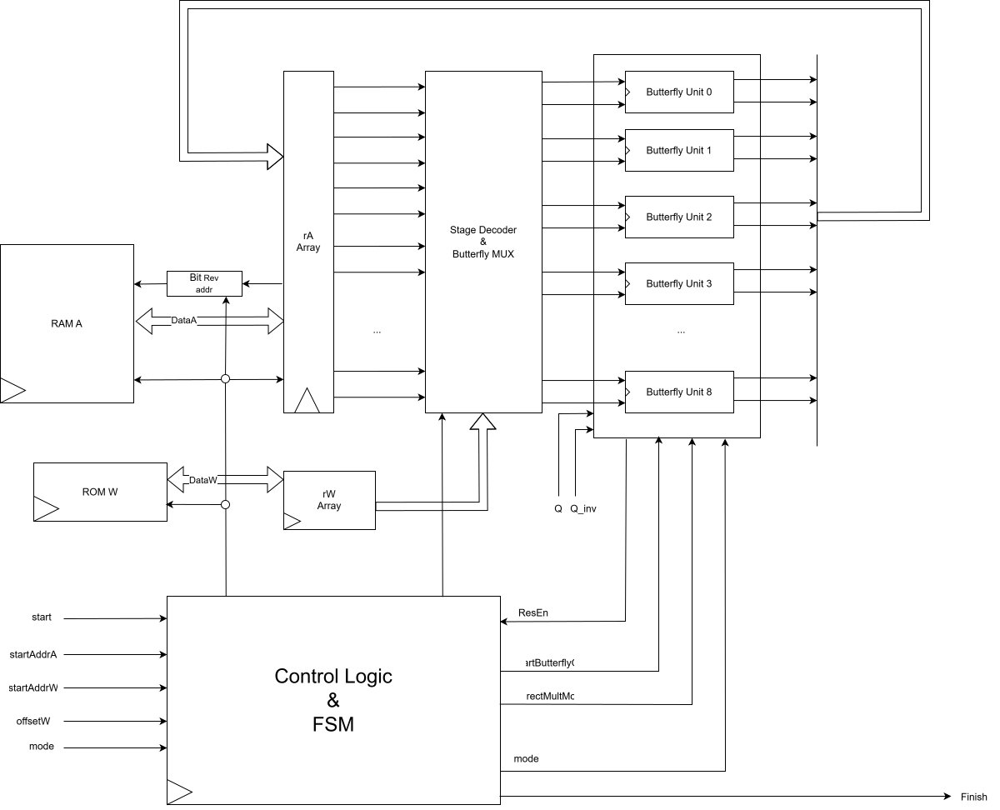
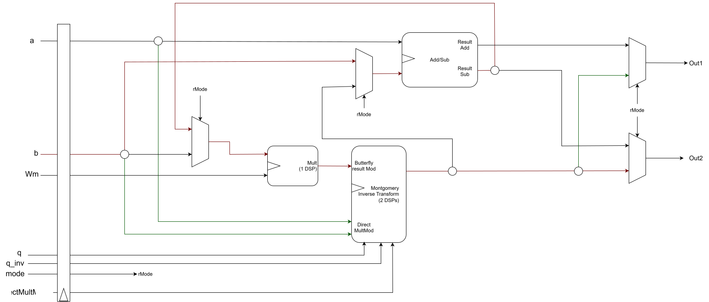

# RTL Design Details
This directory contains all RTL, Memory, and Testbench source codes.
This document contains design details of each RTL modules.

## 1. NTT Top-Level Control (`ntt_butterfly.sv`)
The `ntt_butterfly.sv` module contains the NTT/iNTT transformation by managing the data movement between BRAM and the parallel arithmetic units.

### Key Architectural Features:
* **In-Place Transformation:** Optimized memory footprint using an in-place NTT algorithm on dual-port BRAM.
* **Pre-computed Twiddle Factors:** ROM-based storage currently configured for **$q=7681$** and **$N=16$**.
* **Stage-Based Routing:** A specialized stage decoder and MUX network manages operand distribution to **8 parallel Butterfly Units** (BF_UNIT=8). 
* **ROM-Based Butterfly Unit Address for Exceed Stage** According to complexity of MUX and Address calculation after Stage 3, This design choose ROM Based decoder instead of normal address computation.
* **2 Port Register Write Back** Store Butterfly result in Temporary register (Depth=16) and gradually write 2 data to rA while next operation is running

### 5-State Hardware FSM:
The controller utilizes a 5-state FSM to decouple memory access from arithmetic execution:
- **State 0 (IDLE):** Standby mode awaiting the `start` signal.
- **State 1 (RD_DATA):** Address generation and retrieval of BRAM coefficients/ROM twiddle factors.
- **State 2 (BF):** Butterfly arithmetic execution (CT or GS).
- **State 3 (Scale):** iNTT result scaling.
- **State 4 (WB):** write-back to BRAM.

## 2. Flexible Butterfly Unit (`butterfly_unit.sv`)

The Butterfly Unit is the core arithmetic engine, designed for high resource utilization through logic sharing.

### Key Architectural Features:
* **Unified Datapath:** Supports both **Cooley-Tukey (NTT)** and **Gentleman-Sande (iNTT)** configurations within a single shared-logic module.
* **Montgomery Reduction:** Implements efficient modular multiplication without dividers, significantly shortening the critical path.
* **Direct Arithmetic Access:** Feature a `directMultMod` mode to utilize the Montgomery multiplier as a standalone modular resource.

## 3. NTT Top Module (`ntt_top.sv`)
The top-level wrapper integrates the NTT core with a register-mapped bus interface, enabling seamless SoC integration.

| Register Name | Address | Access | Description |
| :--- | :--- | :--- | :--- |
| **NTT_CR** | 0x410 | R/W | Control: [0] Start, [1] Mode (NTT/iNTT), [2] Done Flag (Read-only) |
| **NTT_STADDRA**| 0x411 | R/W | Base address of polynomial coefficients in RAM A |
| **NTT_STADDRW**| 0x412 | R/W | Base address of twiddle factors in ROM |
| **NTT_OSW** | 0x413 | R/W | ROM address offset for iNTT twiddle factors |
| **NTT_DATAQ** | 0x414 | R/W | Modulus parameter $q$ (e.g., 7681) |
| **NTT_DATAQINV**| 0x415 | R/W | Montgomery constant $q'$ |
| **NTT_RAMA_WRITE**| 0x500+ | R/W | Memory-mapped access to Coefficient RAM A |

