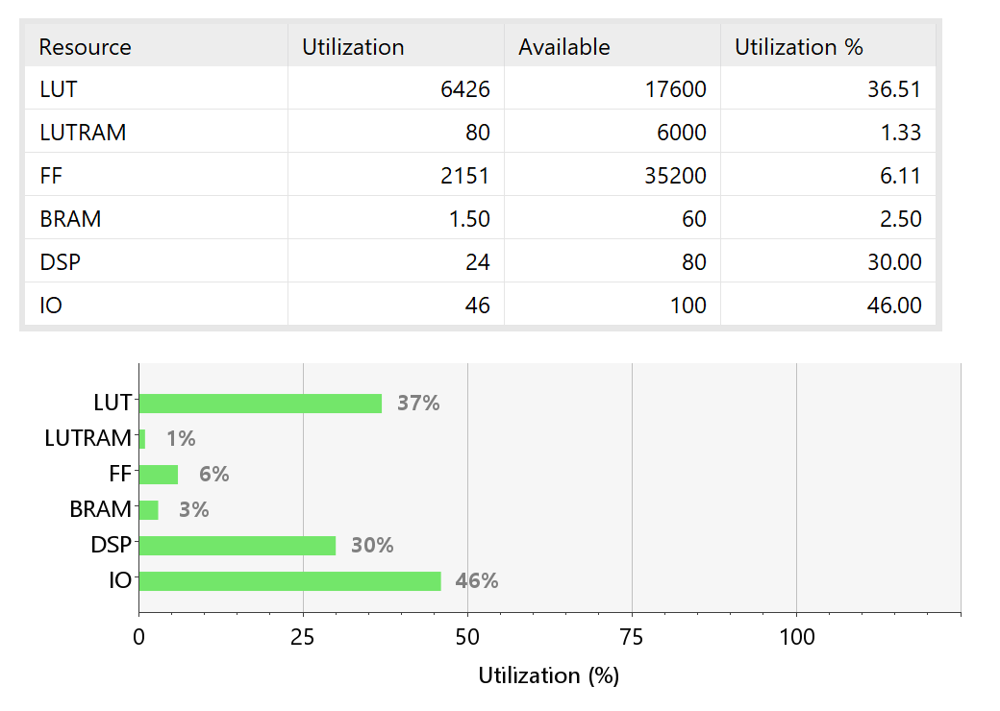
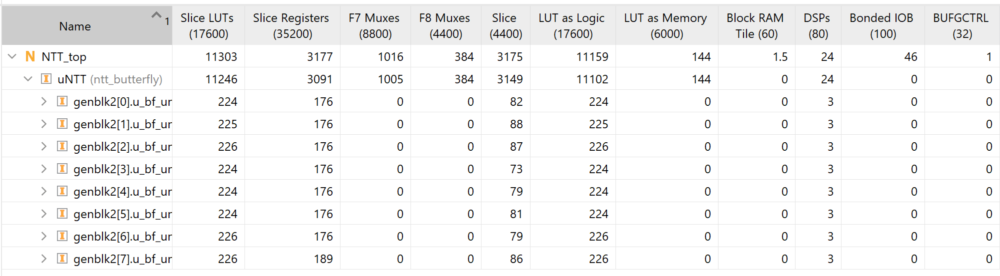
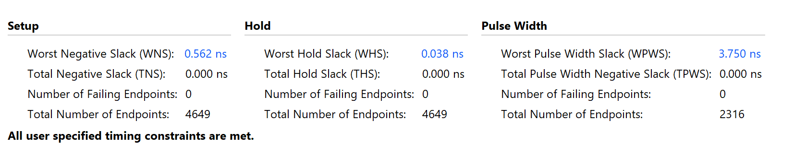
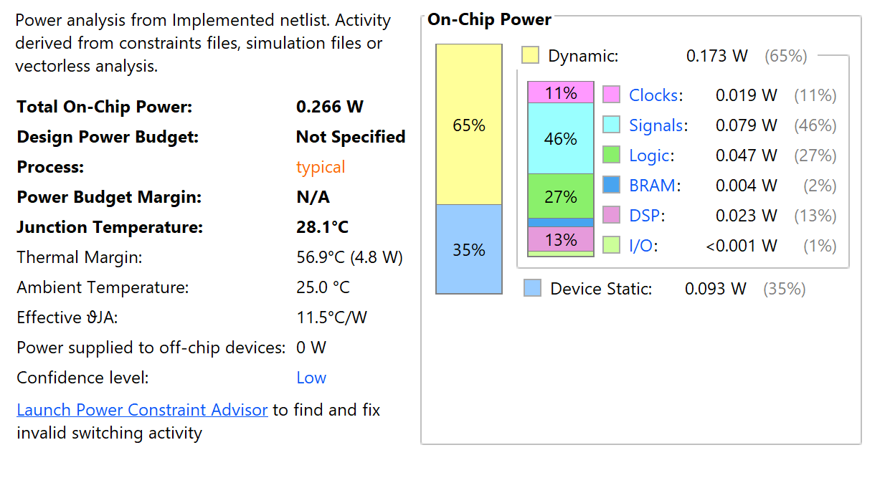

# FPGA Implementation
This directory contains vivado project folders of NTT Accelerator FPGA implementation.

## Specification
- **Target Board** : Alinx AX7010
- **FPGA Chip** : Xilinx Zynq7000 (xc7z010clg400-1)
- **Target Frequency** : 100 MHz

## Implementation Result
**Note** Implemented Design : N=64

### **Resource Usage**

Resource Utilization Summary

Hierarchy

- **LUTs** : 11303
- **FFs** : 3177
- **BRAMs** : 1.5
- **DSPs** : 24

### **Timing Result**
---
Timing Summary (Frequency = 100MHz)

- **Setup WNS** : 0.242ns
- **Hold WHS** : 0.020ns
- **WPWS** : 3.750 ns

*All timing constraits are met*

### **Power Usage**
---

Power Consumption Summary

- **Dynamic Power** : 0.173W
- **Total Power** : 0.266W

*Dynamic = 50% of total power (~Device static)*